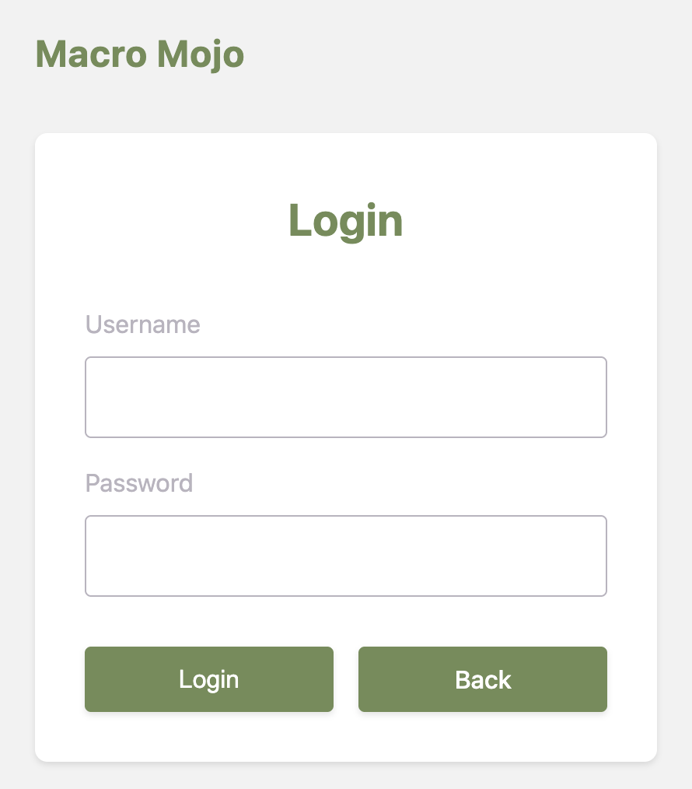
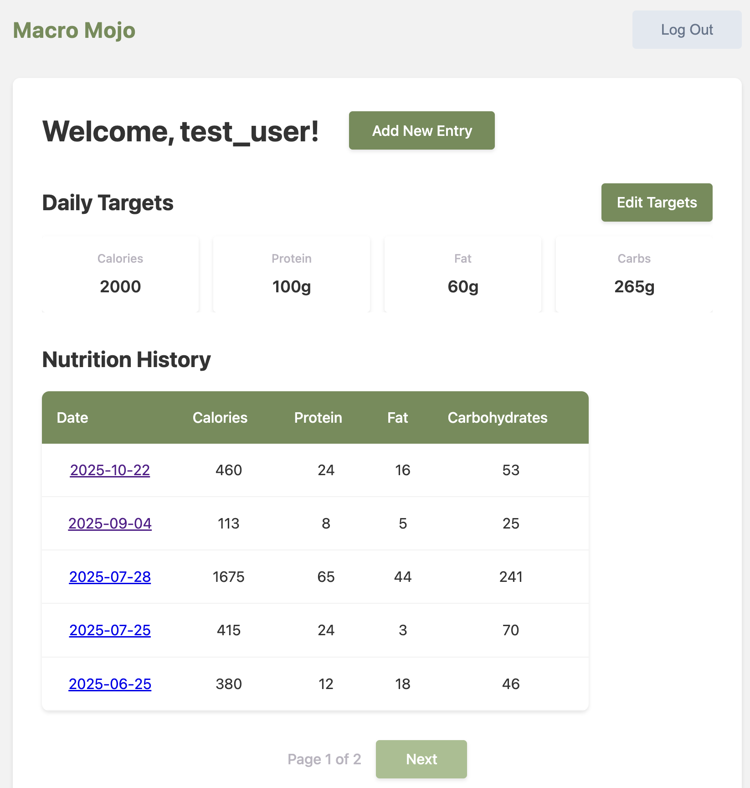
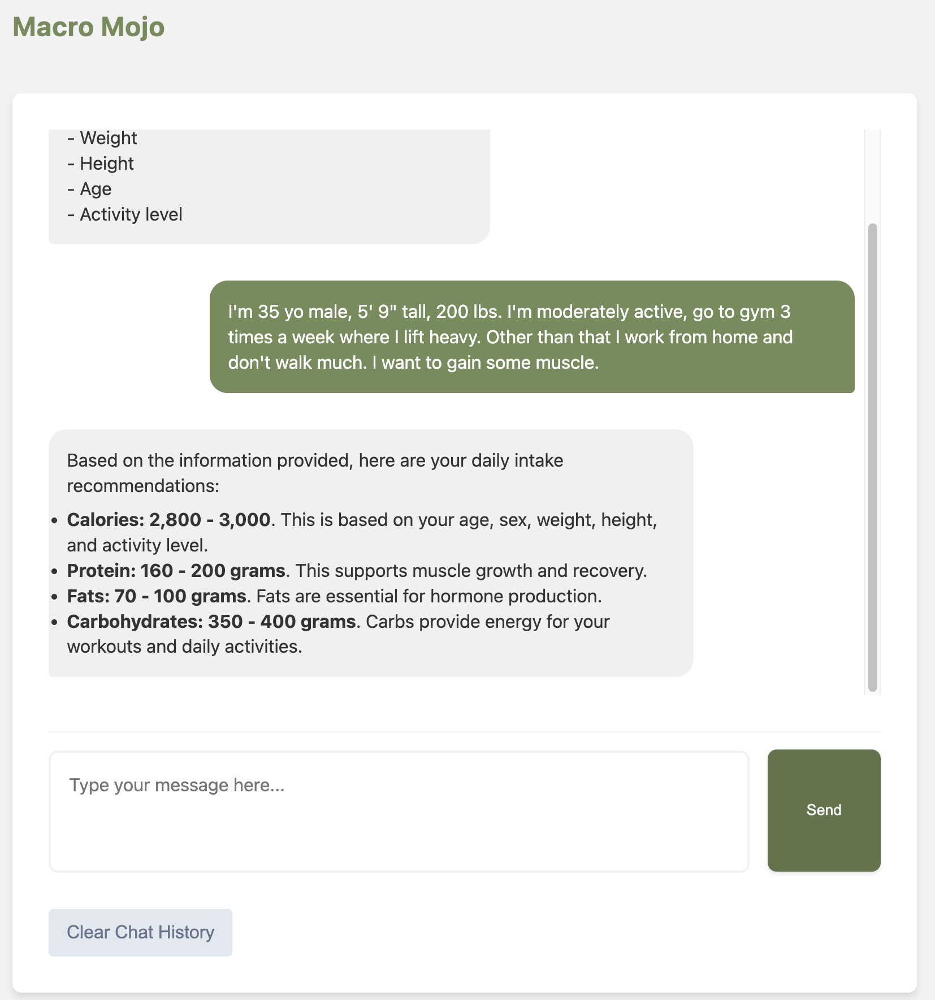

# Macro Mojo

Macro Mojo is a full-stack nutrition tracking web application that helps users 
set calorie and macronutrient goals, log meals, and monitor daily progress. It
includes authentication, database persistence, data validation, and an 
AI-powered assistant for personalized nutrition targets.

## Tech Stack

* **Backend Framework:** Python, Flask, psycopg2
* **Database:** PostgreSQL
* **AI Integration:** OpenAI API
* **Frontend:** HTML, CSS, Jinja2 templates, embedded JavaScript
* **Environment & Dependency Management:** Poetry
* **Security & Authentication:** Input validation, SQL query sanitation, 
            protected routes, session-based authentication, bcrypt password
            hashing
* **Testing:** Pytest

## Features

* User authentication with session management and bcrypt password hashing
* Relational database with normalized schema
* Full CRUD functionality for nutrition records
* SQL queries sanitization and input validation to prevent injection attacks
* Modular architecture for maintainability and future scalability
* AI assistant for personalized nutrition recommendations

## Installation & Setup

### Prerequisites

- Poetry: 2.0.0+
- Python: 3.13.0+
- PostgreSQL: 17.4+
- OpenAI API key 

### Quick Start

1. **Clone and set up environment**
    ```
    git clone [REPOSITORY_URL]
    cd macro_mojo
    poetry install
    ```
    
2. **Configure environment**
   Create `.env` file and add OpenAI API key to enable AI assistant:

    ```OPENAI_API_KEY = "your-key-here"```

    Note: Python virtual environment is managed by Poetry.

3. **Set up database**
    * Create a database `macro_mojo`. Run command in terminal:

        ```createdb macro_mojo```

    * Initialize schema and seed data

      ```
      psql -d macro_mojo < schema.sql
      psql -d macro_mojo < data.sql
      ```

4. **Launch application**

    ```poetry run python app.py```

5. **Navigate to `http://localhost:5003/`**

## Development Credentials

```
Username: `test_user`
Password: `test_pwd`
```

## Application Screenshots 

### Login



### Dashboard




### New Entries, Targets, Launch AI Assistant


### AI Assistant

AI assistant provides advice on calories and macronutrient targets based on 
user details (age, sex, weight, height, activity level) and their goals (e.g.
lose weight, gain weight, gain muscle).

* Click 'Clear Char History' to delete ongoing conversation and start over



## Development Roadmap

### Tech Enhancements

* **Security:** CSRF protection implementation (Flask-WTF)
* **ORM Integration:** Migrate to SQLAlchemy
* **Cloud Deployment:** Production deployment on Render
* **AI Framework:** Migration to LangChain v1.0
* **Performance:** Caching layer and database connection pooling

### Feature Expansions
* **Data Analytics:** Trend analysis
* **Weight Tracking**

## License
MIT


## Version History

* **0.1.0:** Initial release

**Last Updated:** October 2025


